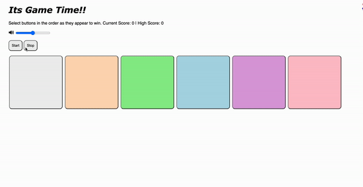

# Pre-work - *Its Game Time*

**Its Game Time** is a Light & Sound Memory game to apply for CodePath's SITE Program. 

Submitted by: **Kuljot Singh**

Time spent: **10** hours spent in total

Link to project: https://glitch.com/edit/#!/its-game-time-

## Required Functionality

The following **required** functionality is complete:

* ✅ Game interface has a heading (h1 tag), a line of body text (p tag), and four buttons that match the demo app
* ✅ "Start" button toggles between "Start" and "Stop" when clicked. 
* ✅ Game buttons each light up and play a sound when clicked. 
* ✅ Computer plays back sequence of clues including sound and visual cue for each button
* ✅ Play progresses to the next turn (the user gets the next step in the pattern) after a correct guess. 
* ✅ User wins the game after guessing a complete pattern
* ✅ User loses the game after an incorrect guess

The following **optional** features are implemented:

* ✅ Any HTML page elements (including game buttons) has been styled differently than in the tutorial
* ✅ Buttons use a pitch (frequency) other than the ones in the tutorial
* ✅ More than 4 functional game buttons
* ✅ Playback speeds up on each turn
* ✅ Computer picks a different pattern each time the game is played
* ❌ Player only loses after 3 mistakes (instead of on the first mistake)
* ❌ Game button appearance change goes beyond color (e.g. add an image)
* ❌ Game button sound is more complex than a single tone (e.g. an audio file, a chord, a sequence of multiple tones)
* ✅ User has a limited amount of time to enter their guess on each turn

## Video Walkthrough (GIF)
 

## Reflection Questions
1. If you used any outside resources to help complete your submission (websites, books, people, etc) list them here. 
stackoverflow,W3 Schools,

2. What was a challenge you encountered in creating this submission (be specific)? How did you overcome it? (recommended 200 - 400 words) 
The basic requirement for the project was very easy and straight forward the problem started from the bonus part of the assignemnt. The extra features required a bit extra time and some help from the online resources.
The resources helped alot in building and understanding the concept.

3. What questions about web development do you have after completing your submission? (recommended 100 - 300 words) 
I have been working and learning the machine learning and other topics and was under estimating the power and area of scope of this domain.
The web development lets you put all your imagination on screen and some times makes it real.I think there are many things above and beyond that i need still need learn. There is alot apart form the head body and paragraph tag.
I need to learn alot and add skills .

4. If you had a few more hours to work on this project, what would you spend them doing (for example: refactoring certain functions, adding additional features, etc). Be specific. (recommended 100 - 300 words) 
If I had a bit more time to work on this project would have deifinetly worked on the three extra things which I have missed from the extra stuff and would have made some prefference in the difficulty of the game and would have played with some themes and sound options.
There are alot more things that can be done and make the game very fun and intresting.

## Interview Recording URL Link

[My 5-minute Interview Recording](https://github.com/kuljotChadha/SITE_PREWORK/blob/main/VideoInterview.mp4)

## License

    Copyright [kuljot Singh]

    Licensed under the Apache License, Version 2.0 (the "License");
    you may not use this file except in compliance with the License.
    You may obtain a copy of the License at

        http://www.apache.org/licenses/LICENSE-2.0

    Unless required by applicable law or agreed to in writing, software
    distributed under the License is distributed on an "AS IS" BASIS,
    WITHOUT WARRANTIES OR CONDITIONS OF ANY KIND, either express or implied.
    See the License for the specific language governing permissions and
    limitations under the License.